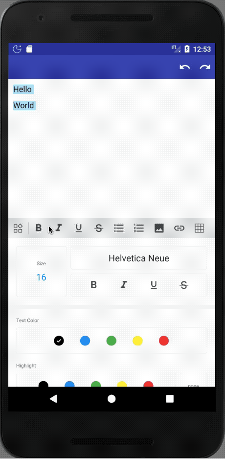
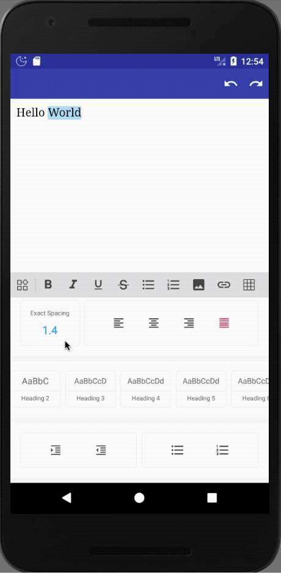
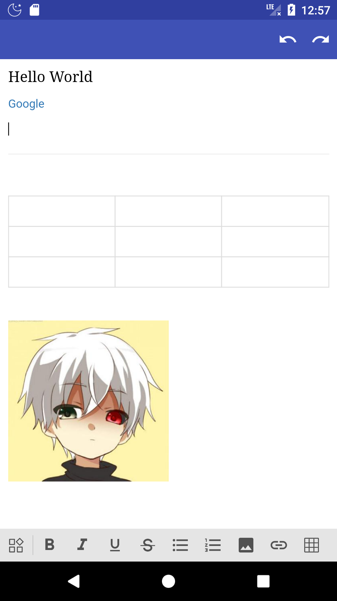

Editor
======
富文本编辑器 (项目原地址(https://github.com/Even201314/MRichEditor))
因为原项目Compile不下来，所以自己上传了一份，按自己喜好修改了下包名。

## 功能

- Bold
- Italic
- Underline
- Strike-through
- Heading 1
- Heading 2
- Heading 3
- Heading 4
- Heading 5
- Heading 6
- Paragraph
- Quote
- Ordered List
- Unordered List
- Code
- Horizontal Rule
- Link
- Image
- Justify Center
- Justify Full
- Justify Left
- Justify Right
- Subscript
- Superscript
- Font Name
- Font Size
- Indent
- Outdent
- Undo
- Redo

#### Screenshot

